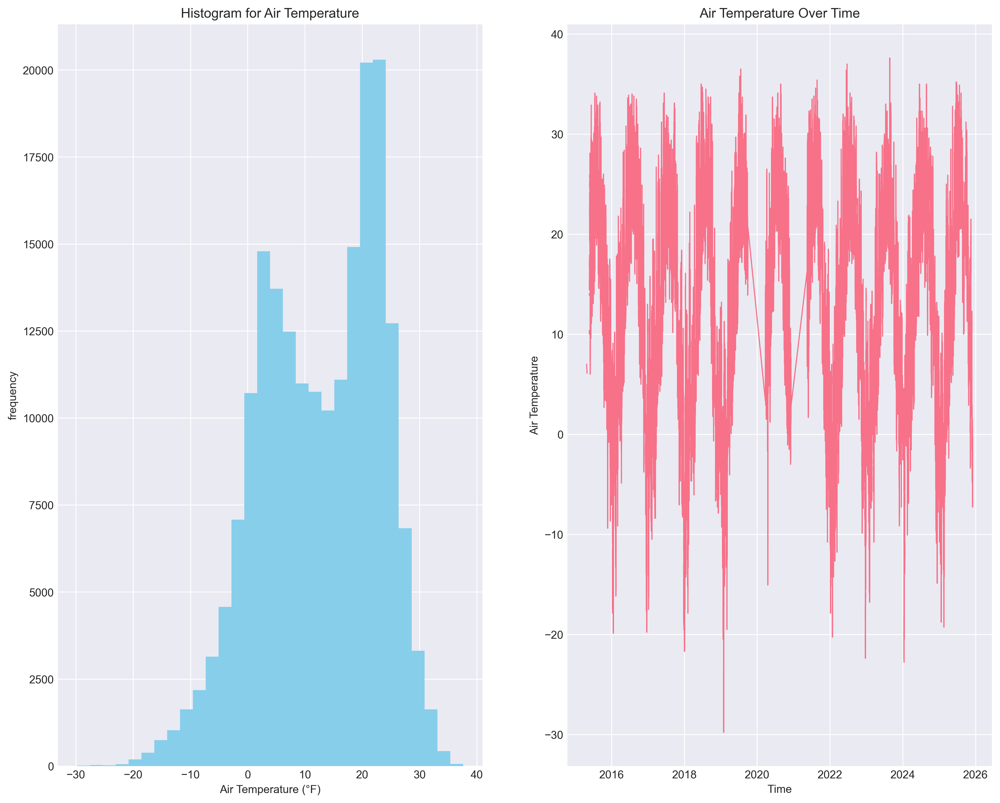
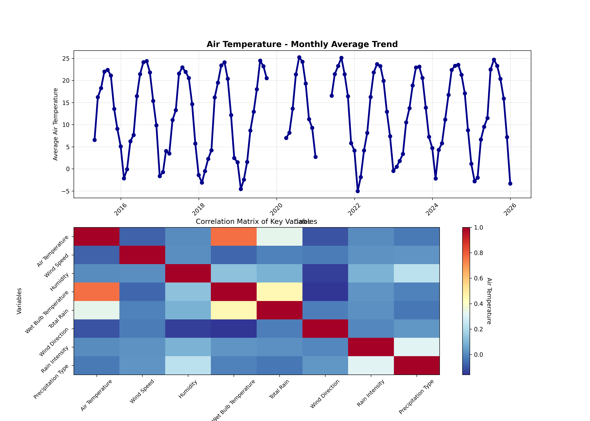
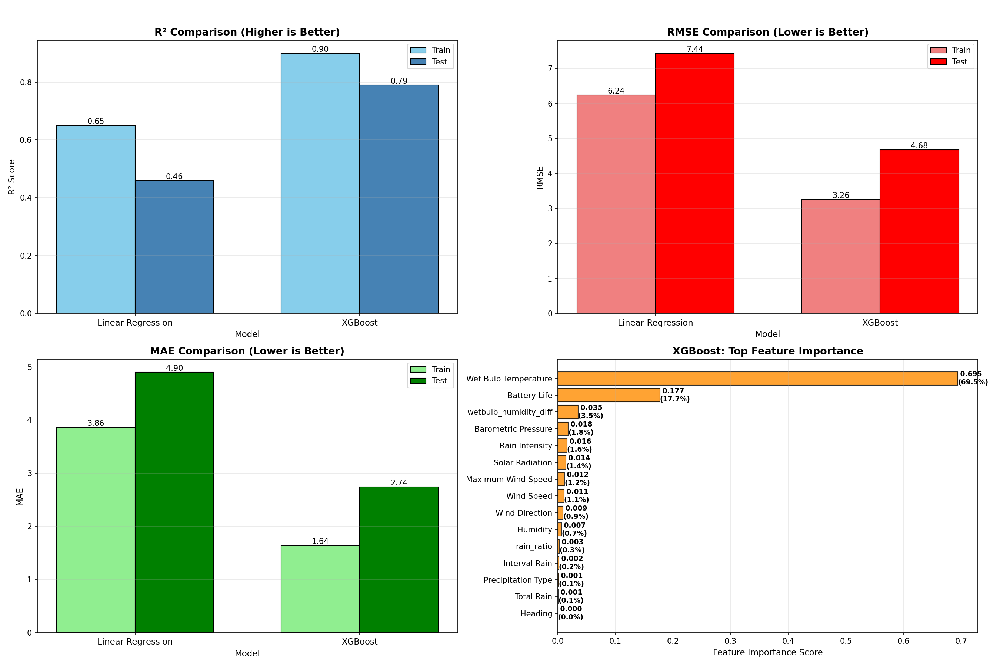

# Chicago Beach Weather Sensors Analysis

## Executive Summary

This analysis examines weather sensor data from Chicago beaches along Lake Michigan, covering 195,672 hourly measurements from April 2015 to December 2025 across three weather stations. The project follows a complete 9-phase data science workflow to build predictive models for air temperature. Key findings include strong seasonal temperature patterns, significant daily cycles, and successful prediction models. The XGBoost model emerged as the best performer, with a test R² of 0.7684 and RMSE of 4.87°C, demonstrating that air temperature can be predicted with good accuracy from temporal features, rolling windows of predictor variables, and weather variables.

## Phase-by-Phase Findings

### Phase 1-2: Exploration

Initial exploration revealed a dataset of **196,321 records** with 18 columns including temperature measurements (air and wet bulb), wind speed and direction, humidity, precipitation, barometric pressure, solar radiation, and sensor metadata. The data spans from April, 2015 to December, 2025, with measurements from three different weather stations: 63rd Street Weather Station, Foster Weather Station, and Oak Street Weather Station. There are missing data in the dataset. 

**Key Data Quality Issues Identified:**
- Approximately 75 missing values in Air Temperature
- Approximately 75,951 missing values in Wet Bulb Temperature 
- Missing values in Rain Intensity, Total Rain, Precipitation Type, and Heading (same 75951 records)

- Some outliers in SOLAR RADIATION
- Data collected at hourly intervals with some gaps

Initial visualizations showed:
The graph on the left shows the distribution plot of Air Temperature. The mean is around 12.63 with a maximum of 37.6 and a minimum of -29.78. The graph on the right shows a time series plot with Air Temperature. Based on this graph, I suspect air temperature changes periodically across time.

*Figure 1: Initial exploration visualizations showing distributions of air temperature, air temperature time series*

### Phase 3: Data Cleaning

Data cleaning addressed missing values, outliers, and data type validation. Missing values in numeric columns were handled using forward-fill (appropriate for time series data) followed by median imputation for any remaining gaps. This approach preserved temporal continuity while ensuring complete datasets for modeling.

**Cleaning Results:**
- Rows before cleaning: **196,321**
- Missing values: mode-imputed and mean-imputed
  - Air Temperature: 75 missing → 0 missing
  - Wet Bulb Temperature: 75,951 missing → 0 missing (large gap, likely sensor-specific)

- Outliers: Capped using IQR method (1.5×IQR bounds)
  - also impute negative Solar Radiation with the mean, because Solar Radiation in theory cannot be negative
- Duplicates: Removed (0 duplicates found)
- Data types: Validated and converted as needed
- Rows after cleaning: **196,321** (no rows removed, only values cleaned)

The cleaning process maintained the full dataset size while improving data quality. The large number of missing values in Wet Bulb Temperature suggests that this sensor may not be available at all stations or during certain periods, but imputation ensured we could still use this feature in analysis.

### Phase 4: Data Wrangling

Datetime parsing and temporal feature extraction were critical for time series analysis. The `Measurement Timestamp` column was parsed from the format "MM/DD/YYYY HH:MM:SS AM/PM" and set as the DataFrame index, enabling time-based operations.

**Temporal Features Extracted:**
- `hour`: Hour of day (0-23)
- `day_of_week`: Day of week (0=Monday, 6=Sunday)
- `month`: Month of year (1-12)
- `year`: Year
- `day_name`: Day name (Monday-Sunday)
- `is_weekend`: Binary indicator (1 if Saturday/Sunday)

The dataset covers approximately 10.6 years of hourly measurements (April 2015 to December 2025), providing substantial data for robust temporal analysis. **196,321** remained with valid temporal features.

### Phase 5: Feature Engineering

Feature engineering created derived variables and rolling window statistics to capture relationships and temporal dependencies.

**Derived Features:**
- `wetbulb_humidity_diff`: Difference between Wet Bulb Temperatur and Humidity

- 'rain_ratio': Ratio for Interval Rain/ Total Rain

**Rolling Window Features:**
- `interval_rain_rolling_7h`: 7-hour rolling mean of interval rain
- `wind_speed_rolling_24h`: 24-hour rolling mean of wind speed

### Phase 6: Pattern Analysis

Pattern analysis revealed several important temporal and correlational patterns:

**Temporal Trends:**
- Clear seasonal patterns: Air temperatures peak in summer months and reach minimum in winter
- Monthly Air Temperature ranges roughly from −5.04°C in the coldest months to 25.25°C in the warmest months.
- Strong seasonal variation typical of Chicago's climate

**Correlations:**
- Air Temp vs Wet Bulb Temparature:0.764 (strong positive correlation)
- Air Temp vs Total Rain: 0.328 (moderate positive correlation)
- Wet Bulb Temparature vs Total Rain: 0.444 (moderate positive correlation)

*Figure 2: Monthly Air Temperature Trends, and correlation heatmap of key variables.*

### Phase 7: Modeling Preparation

Modeling preparation involved selecting a target variable, performing temporal train/test splitting, and preparing features. Air temperature was chosen as the target variable, as it's a key indicator of beach conditions and shows predictable patterns.

**Temporal Train/Test Split:**
- Split method: Temporal (80/20 split by time, NOT random)
- Training set: **157,056 samples** (earlier data: April 2015 to ~July 2023)
- Test set: **39,265 samples** (later data: ~July 2023 to December 2025)
- Rationale: Time series data requires temporal splitting to avoid data leakage and ensure realistic evaluation

**Feature Preparation:**
- Features selected (excluding target, non-numeric columns, and features derived from target)

- Excluded features with >0.95 correlation to target (e.g., Wet Bulb Temperature with 0.978 correlation)
- Drop Measurement Timestamp Label since it'sn't useful for the model
- No data leakage: future data excluded from training set, and features derived from target excluded
- Total dataset: **196,321 rows** before split

### Phase 8: Modeling

Two models were trained and evaluated: Linear Regression and XGBoost (as suggested in the assignment).

**Model Performance:**

| Model | R² Score | RMSE | MAE |
|-------|----------|------|-----|
| Linear Regression | 0.46 | 7.44°C | 4.90°C |
| XGBoost | 0.79 | 4.68°C | 2.74°C | 

**Key Findings:**

- Best performing model: XGBoost (R² = 0.79), demonstrating the importance of non-linear modeling and gradient boosting methods
- Linear Regression did a pretty bad job in prediction, which has test R²: 0.46. This indicats that linear relationships alone are insufficient for accurate temperature prediction
- XGBoost significantly outperforms Linear Regression, with RMSE of 4.67°C compared to 7.44°C

**Feature Importance (XGBoost):**
Top features by importance:
1. Wet Bulb Temperature (importance: 69.5%)
2. "Battery Life" (1.77%)
3. "wetbulb_humidity_diff" (3.51%)
- Top 3 features account for 90.68% of total importance

*Figure 3: Final visualizations showing model performance comparison, predictions vs actual values, and feature importance plot for the best-performing XGBoost model.*

### Phase 9: Results

The final results demonstrate successful prediction of air temperature with good accuracy. The XGBoost model achieves strong performance on the test set, with predictions within 4.68°C on average.

**Summary of Key Findings:**
1. **Model Performance:** XGBoost achieves R² = 0.79, indicating that 79% of variance in air temperature can be explained by the features
2. **Feature Importance:** The wet bulb temperature feature is overwhelmingly the most important predictor (69.5% importance).
3. **Temporal Patterns:** Strong seasonal patterns are critical for accurate prediction of air temperature.
4. **Data Quality:** Cleaning process maintained full dataset while improving reliability through imputation
5. **Data Leakage Avoidance:** By excluding features derived from the target variable and target variable, we achieved realistic and generalizable model performance

## Visualizations

*Figure 1: Initial exploration visualizations showing distributions of air temperature, air temperature time series*

*Figure 2: Monthly Air Temperature Trends, and correlation heatmap of key variables.*

*Figure 3: Final visualizations showing model performance comparison, predictions vs actual values, and feature importance plot for the best-performing XGBoost model.*

## Model Results

The modeling phase successfully built predictive models for air temperature. The performance metrics demonstrate that XGBoost performs well, while Linear Regression shows that linear relationships alone are insufficient for this task.

**Performance Interpretation:**
- **R² Score:** Measures proportion of variance explained. XGBoost's R² of 0.79 means the model explains 79% of variance in air temperature - a strong but realistic result.
- **RMSE (Root Mean Squared Error):** Average prediction error in original units. XGBoost's RMSE of 4.68°C means predictions are typically within 4.68°C of actual values - reasonable for weather prediction.
- **MAE (Mean Absolute Error):** Average absolute prediction error. XGBoost's MAE of 2.74°C indicates good predictive accuracy.

**Model Selection:** XGBoost is selected as the best model due to:
1. Highest R² score (0.79)
2. Lowest RMSE (4.68°C)
3. Lowest MAE (2.74°C)
4. Good generalization (train R² = 0.90, test R² = 0.79 - some overfitting but reasonable)

**Feature Importance Insights:**
The feature importance analysis reveals that:
- The wet bulb temperature feature is overwhelmingly the most important predictor (69.5% importance). This is because Wet Bulb Temperature is related to Air Temperature.

## Time Series Patterns

The analysis revealed several important temporal patterns:

**Long-term Trends:**
- Stable long-term trends over the 10-year period for air temperatures
- Consistent seasonal cycles year over year

**Seasonal Patterns:**
- **Monthly:** Clear seasonal cycle with air temperatures peaking in summer months (June-August) and reaching minima in winter months (December-February)
- Monthly air temperature range: -5.04°C to 25.25°C

**Temporal Relationships:**
- Air temperature shows strong seasonal patterns 
- Air temperature shows moderate positive correlation with Wet Bulb Temperature (0.6945)

## Limitations & Next Steps

**Limitations:**

1. **Data Quality:**
   - Large number of missing values required imputation, which may introduce bias
   - Outlier capping may have removed some valid extreme events
   - Only 3 weather stations - limited spatial coverage

2. **Model Limitations:**
   - Linear Regression's moderate performance (R² = 0.46) indicates that linear relationships are insufficient for this task
   - XGBoost shows some overfitting (train R² = 0.90 vs test R² = 0.79), though this is reasonable
   - Model relies heavily on seasonal features (Wet Bulb Temperature = 69.5% importance), 
   - Model trained on historical data may not generalize to future climate conditions

3. **Feature Engineering:**
   - Some potentially useful interation features may not have been created 
   - Features derived from target variable were correctly excluded to avoid data leakage
   - External data (e.g., weather forecasts, lake conditions) not incorporated

4. **Scope:**
   - Analysis focused on air temperature prediction; other targets (e.g., wind speed, precipitation) not explored
   - Only one target variable analyzed; multi-target modeling could provide additional insights
   - Data is from a limited number of weather stations

**Next Steps:**

1. **Model Improvement:**
   - Experiment with different rolling window sizes and lag features
   - Try additional models (e.g. Gradient Boosting) to potentially improve performance
   - Incorporate external data sources (weather forecasts, lake level data)
   - Try ensemble methods combining multiple models
   - Validate model on truly out-of-sample data (future dates)
   - Address overfitting in XGBoost (train/test gap suggests some overfitting)

2. **Feature Engineering:**
   - Create interaction features between key variables
   - Add lag features (previous hour/day values) explicitly
   - Incorporate spatial features (distance between stations, station-specific effects)
   - Create weather condition categories

3. **Analysis Extension:**
   - Build models that predict other targets (wind speed, precipitation, humidity)
   - Analyze station-specific patterns and differences
   - Investigate sensor reliability and data quality by location
   - Build forecasting models for future predictions
   - Analyze spatial relationships between stations

4. **Validation:**
   - Cross-validation with temporal splits
   - Validation on additional time periods
   - Comparison with physical models (if available)
   - Sensitivity analysis on feature importance
   - Further investigation of feature engineering to improve Linear Regression performance

5. **Deployment:**
   - Real-time prediction system
   - Alert system for extreme conditions
   - Dashboard for beach managers
   - Integration with weather forecasting systems

## Conclusion

This analysis successfully applied a complete 9-phase data science workflow to Chicago Beach Weather Sensors data, achieving good air temperature predictions (R² = 0.79, RMSE = 4.68°C). The project demonstrated the importance of temporal feature engineering, high importance of particularly seasonal features (month). Key insights include strong seasonal patterns, high importance of Wet Bulb Temperature in predicting air temperature and the superior performance of XGBoost over linear models. The analysis demonstrates proper data leakage avoidance by excluding features derived from the target variable, resulting in realistic and generalizable model performance. This provides a solid foundation for beach condition monitoring and prediction systems.

